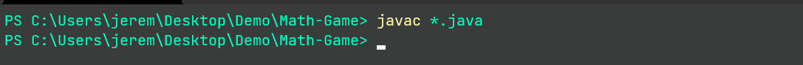
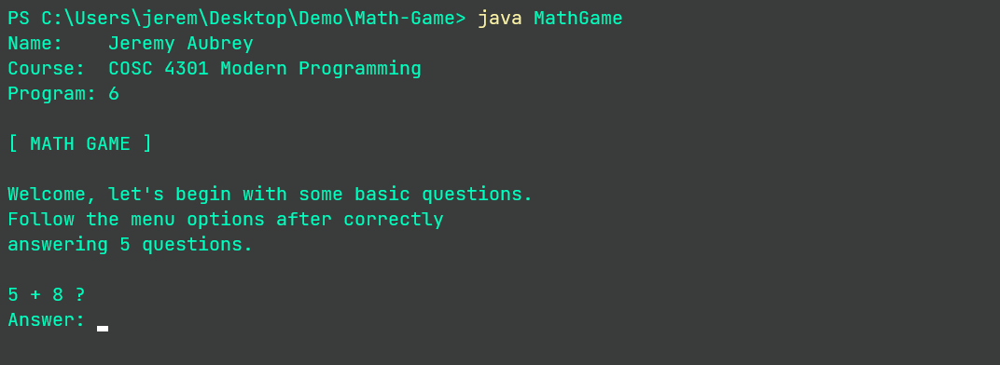
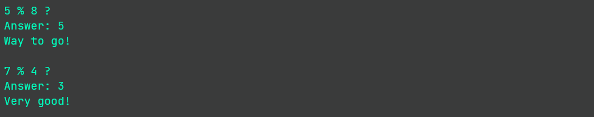
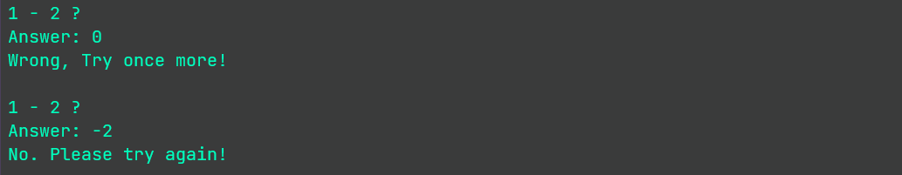
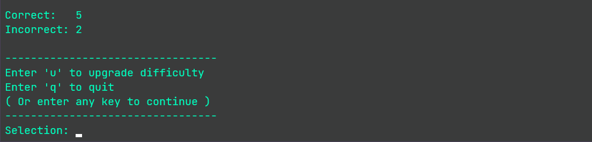
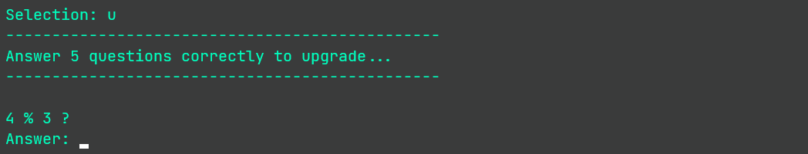
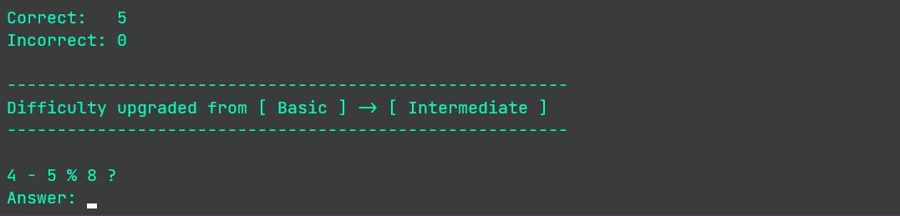
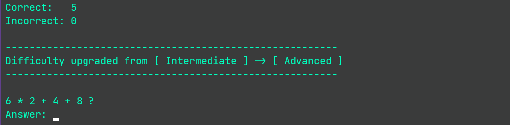
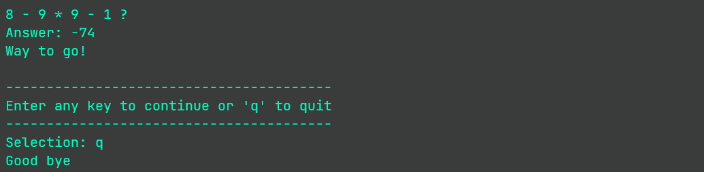

# Interactive math game

An interactive math game in Java to help an elementary school
student learn to evaluate integer arithmetic expressions.

Difficulty levels:

- Basic &nbsp;&nbsp;&nbsp;&nbsp;&nbsp;&nbsp;&nbsp;&nbsp;&nbsp;&nbsp;&nbsp;&nbsp;&nbsp;&nbsp;&nbsp;&nbsp;2 operands, 1 operator
- Intermediate &nbsp;&nbsp;&nbsp;&nbsp;3 operands, 2 operators
- Advanced &nbsp;&nbsp;&nbsp;&nbsp;&nbsp;&nbsp;&nbsp;&nbsp;4 operands, 3 operators 

Players are eligible to upgrade after correctly answering 5 questions.

### To Build:
Download the java source code and run the following command in the same directory:
```powershell
javac *.java
```


### Run:
Start the game

```powershell
java MathGame
```



--- 

Random responses are generated based on the correctness of the answer.

Correct responses



Incorrect responses



--- 

### Upgrading difficulty 

After correctly answering 5 questions, the user can play an upgrade 
round in order to upgrade the difficulty level or quit.

A score is also displayed from the previous round.





---

(Upgrading from basic to intermediate)



(Upgrading from intermediate to advanced)



---

### Exit 

After correctly answering 5 advanced level questions, the 
user can only quit or answer more advanced questions.

